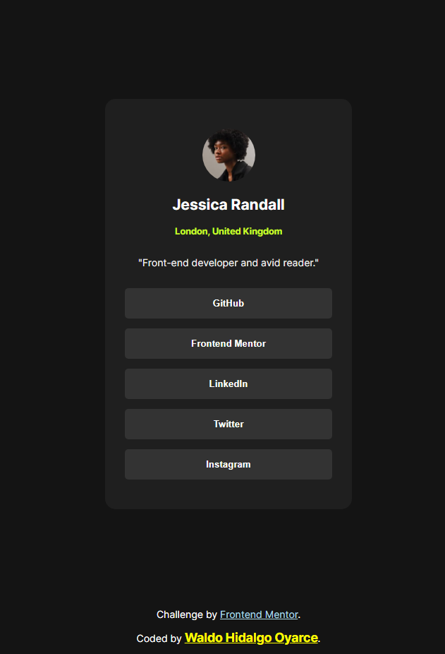
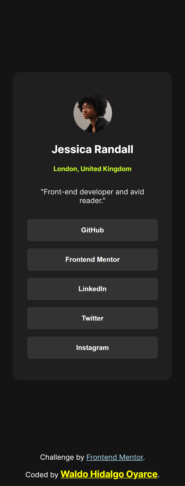
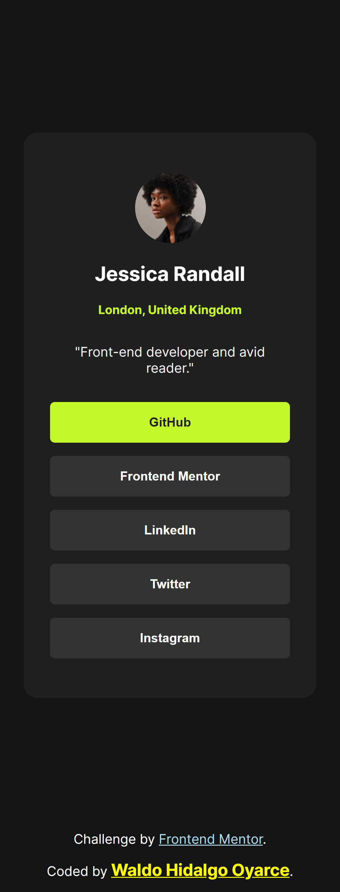

# Frontend Mentor - Social links profile solution

Esta es mi solución al [desafío número dos](https://www.frontendmentor.io/challenges/social-links-profile-UG32l9m6dQ) de Front End Mentor el cual consiste en crear un componente card y darle estilos.

He utilizando:

### The challenge

El desafío consiste en estructurar, estilizar y dar estilos en hover a elementos con los que existe interacción.

### Screenshot

A continuación muestro el proyecto en pantallas grandes:

A continuación muestro el proyecto en pantallas small:

A continuación muestro estilos en hover sobre los elementos que existe interacción:

### Links

- Live Site URL: [Card Live](https://your-live-site-url.com)

### Built with

- Semantic HTML5 markup
- CSS custom properties
- CSS Grid
- Mobile-first workflow
